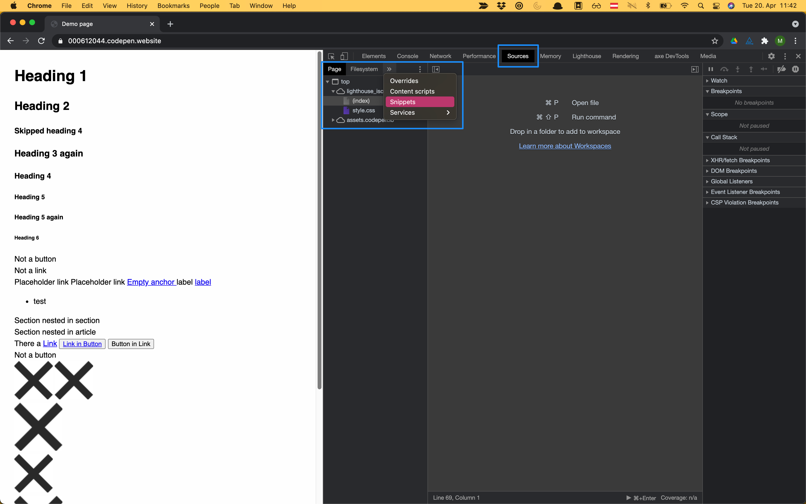

# DevToolsSnippets

A collection of snippets to be used in the [Sources panel](https://developer.chrome.com/docs/devtools/javascript/sources/) in Chrome DevTools.

You can copy these scripts and add them to your collection of snippets.

This not a replacement for automatic testing tools like the [HTML validator](https://validator.w3.org/), [Lighthouse](https://web.dev/measure/?gclid=Cj0KCQjw9_mDBhCGARIsAN3PaFP31wNLbJyN8-iNzbOLDsGQOnIszfGveSQlruMFM5ebkT4IL1Uh574aAmIuEALw_wcB), [axe](https://www.deque.com/axe/), or [Wave](https://wave.webaim.org/). This collection of scripts is meant to be used in addition to automatic testing tools.

## Document Info

* Logs the page `<title>`
* Logs the page description
* Logs the defined natural language
* Logs the charset 
* Logs the number of DOM nodes in `<head>`
* Logs the number of DOM nodes in `<body>`
* Lists headings and document outline

[documentinfo.js](documentinfo/documentinfo.js)
## Debug images

* Lists images without `width` and/or `height` attributes
* Lists images with empty `alt` attributes
* Lists images with _suspicious_  `alt` attributes

[debugimages.js](debugimages/debugimages.js)

## Remove CSS

For testing HTML output without CSS.

* Removes all `<link>`s to CSS files
* Removes all `style` elements
* Removes all `style` attributes

[removecss.js](removecss/removecss.js)

## Is x present?

* Checks if elements that _usually_ should be present, are actually there.
* Checks if elements that _probabaly_ shouldn’t be present, aren’t there.

[isxpresent.js](isxpresent/isxpresent.js)

